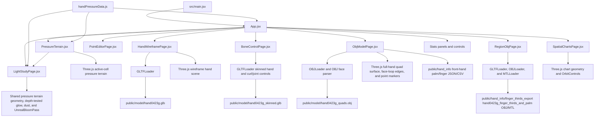

# Pressure Terrain Map Architecture

Last updated: 2026-07-15

## Overview

This is a React, Vite, and Three.js frontend visualization project. It contains:

- Pressure terrain page: renders hand pressure data as a 3D terrain, an embedded 32x32 point editor with adjustable cell size, side statistics, a switchable 32x32 / 64x64 sensor matrix, and a shared customizable six-stop heat-map palette.
- Pressure2 route: `#/pressure2` intentionally falls through to the same dashboard render branch as `/`, so layout, panels, controls, canvas container, `PressureTerrain.jsx`, data pipeline, interpolation, Gaussian smoothing, cutoff, grid, height, color, material, and base rendering all match the main Pressure page.
- Hand wireframe page: loads `hand0423g.glb`, renders it as a cyan glowing wireframe model, and exposes a simplification slider.
- GLB bone-control page: loads the generated and genuinely skinned `hand0423g_skinned.glb`, exposes five finger-curl controls plus weighted joint-level X/Y/Z rotation, and overlays a selectable skeleton helper and joint marker.
- 3D spatial charts page: renders an interactive Three.js data-analysis scene with 3D column, line, donut, radial-progress, pie, and faceted geometry charts plus metric switching, auto rotation, orbit, and zoom controls.
- OBJ model page: loads `hand0423g_quads.obj` by default as the complete hand quad mesh, lets users type another OBJ model name from `public/model`, renders full-hand surface / edge / point grids, and lets users color selected grid points and lines from the pressure matrix.
- Cell OBJ page: loads `hand0423g_finger_thirds_and_palm.obj` as a sensor-cell mesh and displays the full hand GLB as a translucent reference layer so the exported finger-third and palm quads can be inspected in context.
- Authored hand region data: exposes the finger-thirds and rectified-palm coordinate exports from `hand_info/finger_thirds_export` as browser-readable static JSON/CSV for GLB grid filtering and export.
- Point editor page: renders the shared hand points on a 32x32 editable grid, persists the current draft locally, saves multiple named versions, and outputs the updated array.
- Light study page: reuses the live 64x64 hand-pressure terrain as a giant cinematic foreground form with animated grazing light, Bloom, floating dust, responsive typography, pointer/touch parallax, zoom, pause, three selectable light temperatures, and a responsive terrain-transform control panel.

## Tech Stack

| Area | Technology |
| --- | --- |
| Frontend | React `^19.0.0` |
| DOM renderer | React DOM `^19.0.0` |
| Build tool | Vite `^6.0.7` |
| 3D renderer | Three.js `^0.127.0` |
| Postprocessing | Three.js `EffectComposer`, `RenderPass`, `UnrealBloomPass` |
| Model loading | Three.js `GLTFLoader`, `OBJLoader`, `MTLLoader` |
| Mesh reduction | Three.js `SimplifyModifier` |
| Styling | CSS |
| CI/CD | GitHub Actions |

## Structure

```text
E:\shroomLab
|-- ARCHITECTURE.md
|-- index.html
|-- package.json
|-- pnpm-lock.yaml
|-- vite.config.js
|-- .github
|   `-- workflows
|       `-- ci-cd.yml
|-- public
|   |-- model
|   |   |-- hand0423g.glb
|   |   |-- hand0423g_skinned.glb
|   |   |-- hand0423g_regular_square_texture_fixed.glb
|   |   |-- hand0423g_quads.obj
|   |   `-- hand0423g_quads_regular_grid_only.obj
|   `-- hand_info
|       |-- finger_thirds_export
|       |   |-- hand0423g_finger_thirds_and_palm.csv
|       |   |-- hand0423g_finger_thirds_and_palm.mtl
|       |   |-- hand0423g_finger_thirds_and_palm.obj
|       |   |-- hand0423g_finger_thirds_and_palm_summary.json
|       |   `-- hand0423g_palm_rectified_coordinates.csv
|       |-- hand0423g_front_hand_palm_fingers.csv
|       `-- hand0423g_front_hand_palm_fingers.json
|-- scripts
|   `-- build-skinned-hand-glb.mjs
`-- src
    |-- App.jsx
    |-- BoneControlPage.jsx
    |-- HandWireframePage.jsx
    |-- LightStudyPage.jsx
    |-- ObjModelPage.jsx
    |-- PointEditorPage.jsx
    |-- PressureTerrain.jsx
    |-- RegionObjPage.jsx
    |-- SpatialChartsPage.jsx
    |-- handPressureData.js
    |-- pressurePalette.js
    |-- main.jsx
    `-- styles.css
```

## Core Flow



- `src/App.jsx`: owns page routing, height scale, color depth, matrix size, Gaussian kernel size, the six-stop pressure palette, and the shared editable source point array. Routes include `/`, `#/pressure2`, `#/hand-wireframe`, `#/glb-bones`, `#/obj-model`, `#/region-obj`, `#/point-editor`, `#/light-study`, and `#/spatial-charts`.
- `src/SpatialChartsPage.jsx`: creates the `#/spatial-charts` full-screen Three.js scene from three switchable datasets. Reusable geometry helpers build illuminated bars, tube-based trend lines, extruded donut/pie segments, radial progress arcs, labels, chart plates, and a faceted market-shape object; `OrbitControls` provides drag, touch, wheel zoom, auto rotation, and view reset behavior with full renderer/resource cleanup on route or dataset changes.
- `src/LightStudyPage.jsx`: builds the `#/light-study` scene from the same 64x64 pressure frame, Gaussian smoothing, height mapping, six-stop palette, active-cell surface, and grid geometry used by the Pressure page. The terrain is rotated and scaled into the existing giant foreground composition; its depth buffer occludes behind-surface glow sprites, while seeded dust, `UnrealBloomPass`, pointer/touch parallax, wheel zoom, pause/resume, responsive framing, and cold/pearl/ember light temperatures remain available. A collapsible transform panel controls relative X/Y/Z position, pitch/yaw/roll, and scale with live output values and one-click reset; a ref transfers React control state into the current Three.js rig without rebuilding the scene. Terrain geometry updates are capped at 12 fps while the scene renders continuously.
- `src/BoneControlPage.jsx`: loads `/model/hand0423g_skinned.glb`, verifies that GLTFLoader produced a `SkinnedMesh`, and maps the weighted joints to readable finger/segment labels. Five Curl sliders apply local-Z quaternion rotations across each finger chain; `Open` and `Fist` provide full-hand poses, while joint-level X/Y/Z controls remain available for fine adjustment. Non-deforming `_end` joints are omitted from the selector.
- `scripts/build-skinned-hand-glb.mjs`: repairs the source GLB's unbound skeleton by generating smooth four-influence `JOINTS_0` / `WEIGHTS_0` attributes from vertex-to-bone-segment distance, linking the hand mesh node to skin `0`, and writing `public/model/hand0423g_skinned.glb` while preserving the original asset.
- `src/PointEditorPage.jsx`: initializes from unique `HAND_R_VIDEO_POINTS`, restores the saved local draft when present, renders a 32x32 clickable grid with a persisted `6px` to `18px` cell-size control, supports embedded and standalone modes, persists edits to localStorage, manages named saved versions, and emits a formatted array for hand coordinate modeling.
- `src/handPressureData.js`: owns raw right-hand 32x32 points, source pressure values, dynamic source-point normalization, palm internal gap filling, 32x32 / 64x64 matrix generation, bilinear sampling, Gaussian smoothing, and low-value thresholding.
- `src/PressureTerrain.jsx`: builds the Three.js scene and terrain. The terrain samples pressure with bilinear + local Gaussian blending from the current editable point set, only creates faces and surface grid lines where pressure exists, and rebuilds the low-opacity matrix-region base when point coordinates change. Its terrain and surface-grid geometry build/update helpers are exported for the Light Study page to reuse without duplicating pressure-map logic.
- `src/pressurePalette.js`: defines the six heat-map stop positions, default colors, and RGB interpolation shared by the Three.js terrain and DOM sensor matrix.
- `#/pressure2`: uses the same dashboard JSX as `/`, so it has no separate page shell, canvas sizing, terrain interpolation, smoothing, height, color, material, grid, or base implementation.
- `src/HandWireframePage.jsx`: loads `/model/hand0423g.glb`, simplifies its mesh topology with `SimplifyModifier`, renders a continuous low-poly cyan triangle wireframe, and exposes a `55%` to `94%` simplification slider.
- `src/ObjModelPage.jsx`: loads `/model/hand0423g_quads.obj` by default, accepts a typed OBJ file name in the control panel, normalizes the loaded mesh into view, and builds closed quad outlines from the original OBJ face loops so the full hand grid is visible. The `Surface`, `Edges`, `Points`, and `Rotate` controls tune the view; `Coarse` clusters original vertices while preserving edge continuity. The `Data` toggle writes animated pressure colors onto selected grid lines and point markers while dimming non-selected grid lines so the active region stays visually distinguishable. The page loads `/hand_info/hand0423g_front_hand_palm_fingers.json` and `.csv` as the default front-hand/palm/finger selection. `Select` supports rectangle selection, `Clear` empties the set, `All` selects every current grid point, `Palm Map` exports the authored front-hand map, `Copy Map` exports the full OBJ coordinate map, and `Copy XYZ` exports the current model-space `x/y/z` filtered point/quad map.
- `src/RegionObjPage.jsx`: loads `/model/hand0423g_regular_square_texture_fixed.glb` as the full-hand reference, then loads `/hand_info/finger_thirds_export/hand0423g_finger_thirds_and_palm.obj` with its MTL file in the same coordinate group. It normalizes the combined group into view, exposes `Hand`, `Surface`, `Edges`, and `Rotate` toggles, overlays cyan edge/point markers, and reports vertex/quad counts plus OBJ group face counts for each finger-tip, finger-to-palm, and palm segment.
- `src/styles.css`: defines the dark dashboard layout, controls, dynamic matrix grid, terrain panel, wireframe page, cinematic Light Study overlay, and responsive neon/glass overlay styles for the 3D spatial charts scene.
- `.github/workflows/ci-cd.yml`: runs `npm ci` and `npm run build` on pull requests and pushes, then deploys `dist` to a self-hosted server over SSH/rsync from `main` or `master`.
- `vite.config.js`: enables the React plugin and uses relative asset paths with `base: './'` so static deployments work from a server directory or subpath.
- Pressure terrain and sensor matrix colors share six user-editable color stops (`Base`, `Low`, `Cool`, `Mid`, `Warm`, and `High`); Reset restores the original high-saturation cyan, yellow, orange, and red palette.

## Data Notes

- Missing raw sensor locations remain `0` by default.
- The palm area in `HAND_R_VIDEO_POINTS` contains separated horizontal rows and small internal holes. To avoid visible troughs and obvious zero-value cells, palm interior gaps are filled both column-by-column and row-by-row with bounded linear interpolation before target matrix sampling.
- Gaussian kernel size is user-adjustable from `1x1` to `9x9`. `1x1` means no Gaussian spread.
- Target matrix size is user-switchable between `32x32` and `64x64`.
- The matrix-region base is generated from the current editable source point array; dynamic pressure height/color is generated from the pressure matrix over that region.
- Pressure2 is intentionally identical to the main Pressure page; the hash route remains available, but there is no Pressure2-specific terrain or page chrome.
- OBJ pressure selection maps selected OBJ grid point coordinates into the 32x32 source pressure matrix. Selection can come from the authored front-hand JSON/CSV, screen-space rectangle selection, all-points selection, or model-space XYZ range sliders.
- `Palm Map` exports the authored front-hand/palm/finger region from `public/hand_info/hand0423g_front_hand_palm_fingers.json` and `.csv`, including point ids, raw model `x/y/z`, mapped 32x32 `row/col`, source quad ids, and quad center coordinates.
- `hand0423g_quads.obj` is the complete hand grid model used by `#/obj-model` and currently contains 8129 vertices and 7653 faces. `hand0423g_quads_regular_grid_only.obj` is a smaller 803-vertex / 636-face regular sensor grid asset and is not used as the full-hand display model.
- The source `hand0423g.glb` contains 28 joint nodes and inverse-bind matrices but its mesh node has no `skin` reference and no `JOINTS_0` / `WEIGHTS_0`, so it cannot deform. The generated `hand0423g_skinned.glb` adds smooth four-bone weights for all 8129 vertices, links the mesh to the existing skin, and is the only asset used by `#/glb-bones`. The OBJ assets remain static geometry.
- The Cell OBJ page uses the exported OBJ/MTL directly for sensor cells and overlays it with the complete regular-square-texture GLB reference. The current OBJ file contains 803 vertices, 636 quad faces, and 11 OBJ groups.
- On the pressure page, the embedded 32x32 editor, Three.js terrain, matrix-region base, and sensor matrix all consume the same source point array, so clicking a grid cell changes the 3D map immediately.
- Point editor persistence uses browser localStorage keys `shroomLab.handPointEditor.draft.v1` for the active draft, `shroomLab.handPointEditor.versions.v1` for saved versions, and `shroomLab.handPointEditor.cellSize.v1` for the selected cell size.

## Verification

- `npm run build` passes.
- `npm ci` passes using the committed npm lockfile.
- GitHub Actions uses the npm lockfile and does not require local linked dependencies.
- Current data checks:
  - Raw / unique point count: 252 / 252.
  - Matrix-region base: 252 cells at 32x32, 1008 cells at 64x64.
  - Pressure data: 300 active cells at 32x32 + 1x1, 2055 active cells at 64x64 + 5x5.
- Vite still warns that the Three.js chunk is larger than 500 KB. This is a bundle-size warning and does not block the build.
- `#/hand-wireframe` renders the hand model as a connected low-poly triangle wireframe with the reference arrows and simplification slider visible.
- `#/obj-model` renders `hand0423g_quads.obj` as the complete hand quad grid with surface, edge, pressure-data, rectangle selection, XYZ filtering, coarse-grid, rotate, and coordinate-map export controls. The page was browser-checked at `http://127.0.0.1:5175/#/obj-model` after restoring the full-hand OBJ.
- `#/region-obj` renders `hand0423g_finger_thirds_and_palm.obj` as a colored quad mesh over the full hand reference model, with hand, surface, edge, rotate, count, and group-summary controls.
- `#/point-editor` builds successfully, starts from 252 unique points when no saved draft exists, auto-persists the active draft, and supports named saved versions.
- `/` builds successfully with the embedded point editor and shared point state feeding the 3D terrain and sensor matrix.
- The production build passes with the adjustable point-grid cell size and shared six-stop heat palette; palette interpolation was checked at the base, mid, and high stops. Browser interaction verification was unavailable because the in-app browser webview did not attach.
- `#/pressure2` builds successfully and is served by Vite at `http://127.0.0.1:5188/#/pressure2`.
- `#/glb-bones` was browser-checked at `http://127.0.0.1:5175/#/glb-bones`: the generated asset loaded as `28 bones · 1 skinned mesh ready`, Index Curl visibly deformed the weighted surface at `90°`, the `Fist` preset updated all five finger chains, `Open` restored every curl to `0°`, and non-deforming `_end` joints were absent from the detailed selector.
- `#/spatial-charts` passes the production build with switchable revenue, user, and conversion datasets; it uses the existing Three.js dependency and adds no package dependency.
- `#/light-study` was browser-checked at `1280x720` and `390x844`: one WebGL canvas rendered the shared animated pressure-hand terrain, surface grid, grazing light, Bloom, dust, and responsive overlay with no console errors or horizontal mobile overflow. The giant left-side composition and camera framing remain consistent across desktop and mobile.
- Light Study light occlusion was browser-checked across the pointer range: the live pressure surface hides the behind-terrain light through depth testing, while light outside the active terrain silhouette remains visible.
- Light Study terrain transforms were browser-checked on desktop and at `390x844`: the panel opens uniquely, all seven sliders are accessible, X position and Y yaw update their live values without console errors, Reset restores the default composition, and the mobile panel has no horizontal overflow.

## Project Progress

| Date | Work | Description |
| --- | --- | --- |
| 2026-07-09 | Authored OBJ hand region data | Added the front palm and finger coordinate JSON/CSV as static browser data and wired it into OBJ region selection plus coordinate-map export. |
| 2026-07-09 | GLB region-grid model swap | Replaced the OBJ page model with `hand0423g_regular_square_texture_fixed.glb` and wired the `finger_thirds_export` summary/CSV into selectable region overlays. |
| 2026-07-09 | Standalone Cell OBJ page | Added a separate `#/region-obj` page for directly inspecting the exported finger-thirds and palm OBJ mesh. |
| 2026-07-09 | Cell OBJ hand reference | Added the full hand GLB as a translucent reference layer behind the Cell OBJ mesh. |
| 2026-07-09 | Restored full-hand OBJ grid | Switched `#/obj-model` back to `hand0423g_quads.obj` so the page displays the complete hand mesh instead of the 803-point regular-grid-only asset. |
| 2026-07-13 | OBJ model name loader | Added a model-name input to `#/obj-model` so OBJ files under `public/model` can be loaded from the page controls. |
| 2026-07-13 | Continuous pressure terrain | Added `#/pressure2` with a raw-matrix-to-96x96 continuous terrain pipeline, nonlinear peaks, sparse grid lines, warm top lighting, and Bloom. |
| 2026-07-13 | Pressure2 visual tuning | Improved the continuous terrain page with source-matrix spreading, softer nonlinear peaks, darker low-pressure base color, reduced grid density, stronger warm lighting, and a framed title composition. |
| 2026-07-13 | Pressure2 data-shape restore | Restored the original Pressure2 data shape and limited the latest changes to camera, height ratio, colors, and material tuning. |
| 2026-07-13 | Pressure2 Pressure-style tuning | Tuned Pressure2 to borrow the original Pressure visual language by adjusting only camera framing, height ratio, color stops, lighting/material transparency, and Bloom strength. |
| 2026-07-13 | Pressure2 data alignment | Changed Pressure2 to reuse the main Pressure page pressure matrix generation, bilinear interpolation, local Gaussian blend, and cutoff behavior instead of its separate bicubic pipeline. |
| 2026-07-13 | Pressure2 continuity fix | Removed the extra low-pressure floor in Pressure2 height mapping and limited grid lines to connected pressure samples to avoid visible middle-layer breaks. |
| 2026-07-13 | Pressure2 full alignment | Replaced the separate Pressure2 renderer with the shared `PressureTerrain.jsx` component so the page fully matches the main Pressure terrain behavior. |
| 2026-07-13 | Pressure2 shell alignment | Removed the Pressure2-specific full-screen shell and styles so `#/pressure2` renders through the exact same dashboard branch as `/`. |
| 2026-07-13 | Palm continuity fix | Added bounded row-wise palm gap interpolation and widened the palm fill range so internal zero-value cells no longer break the pressure surface. |
| 2026-07-15 | GitHub CI/CD | Added GitHub Actions CI/CD for npm install, Vite build, and SSH/rsync deployment to a self-hosted server; added `vite.config.js` for relative static asset paths. |
| 2026-07-15 | Pressure display controls | Added persisted 32x32 coordinate-grid cell sizing plus a shared six-stop heat-map palette for the terrain and sensor matrix. |
| 2026-07-15 | GLB bone-control page | Added `#/glb-bones` for selecting and rotating all 28 hand joints with skeleton visualization and pose reset controls. |
| 2026-07-15 | True GLB skinning and finger curl | Generated a mesh-bound GLB with smooth four-bone weights and added five direct finger-curl sliders plus Open/Fist poses. |
| 2026-07-15 | Interactive 3D spatial charts | Added `#/spatial-charts` with six spatial chart forms, three live data modes, orbit/zoom, auto rotation, view reset, and responsive dashboard overlays. |
| 2026-07-15 | Cinematic 3D light study page | Added `#/light-study` with procedural surface detail, animated edge light, Bloom, dust, interactive parallax/zoom, pause, color temperatures, and responsive desktop/mobile composition. |
| 2026-07-15 | Light Study depth occlusion | Moved the light sprites behind the sphere and enabled depth testing so the solid form blocks the light core while retaining silhouette glow. |
| 2026-07-15 | Pressure terrain Light Study | Replaced the procedural sphere with the shared live 64x64 Pressure terrain and grid while retaining the cinematic camera composition, responsive layout, interactions, Bloom, and depth-correct backlight. |
| 2026-07-15 | Light Study terrain transform controls | Added a collapsible responsive panel for X/Y/Z position, pitch/yaw/roll, scale, live numeric values, and one-click composition reset without rebuilding the WebGL scene. |

## Update Log

| Date | Type | Description |
| --- | --- | --- |
| 2026-07-08 | Feature | Created React + Three.js pressure terrain visualization. |
| 2026-07-08 | Refactor | Added dynamic surface grid lines that follow terrain height. |
| 2026-07-08 | Feature | Added right-hand sensor point mapping from `HAND_R_VIDEO_POINTS`. |
| 2026-07-08 | Refactor | Expanded the terrain canvas and tuned opacity, color, and glow. |
| 2026-07-08 | Feature | Added `#/hand-wireframe` GLB wireframe page. |
| 2026-07-08 | Feature | Added 64x64 terrain and adjustable height/color controls. |
| 2026-07-08 | Refactor | Added bilinear interpolation and Gaussian smoothing to pressure sampling. |
| 2026-07-08 | Feature | Added Gaussian kernel size control and 32x32 / 64x64 switching. |
| 2026-07-08 | Fix | Filled only palm-internal source gaps to remove artificial troughs between palm sensor rows. |
| 2026-07-08 | Refactor | Replaced sampled hand triangle lines with a connected low-poly triangle wireframe generated by `SimplifyModifier`. |
| 2026-07-08 | Fix | Restored hand wireframe rendering by fixing simplified geometry index handling and adding a simplification fallback. |
| 2026-07-08 | Feature | Added a visible hand wireframe simplification slider for tuning triangle density. |
| 2026-07-08 | Fix | Made hand wireframe cleanup compatible with Three.js `0.127.0` by replacing `removeFromParent()` usage. |
| 2026-07-08 | Feature | Added 32x32 hand point editor with click-to-add and click-to-remove behavior. |
| 2026-07-08 | Refactor | Increased pressure terrain and sensor matrix color saturation. |
| 2026-07-08 | Feature | Replaced the hand point set with the modeled 208-point matrix and added a rendered matrix-region base under the dynamic pressure terrain. |
| 2026-07-08 | Data Update | Replaced the hand matrix coordinates with the latest 252-point base set. |
| 2026-07-08 | Feature | Added `#/obj-model` page for loading `hand0423g_quads.obj` with surface, edge, and rotate controls. |
| 2026-07-08 | Fix | Replaced angle-based OBJ edge rendering with original face-loop edge parsing so quad outlines render completely. |
| 2026-07-08 | Feature | Added a `Coarse` slider on the OBJ page for adjustable closed-quad edge density. |
| 2026-07-08 | Fix | Changed OBJ coarse rendering from skipped faces to vertex-clustered original edge connectivity to keep coarse wireframes continuous. |
| 2026-07-09 | Feature | Added palm-only pressure projection on the OBJ model surface using animated vertex colors from the existing pressure matrix. |
| 2026-07-09 | Refactor | Moved OBJ palm pressure visualization from the surface mesh to colored grid lines and point markers. |
| 2026-07-09 | Feature | Added rectangle selection on the OBJ page so users can choose which grid points and lines receive pressure coloring. |
| 2026-07-09 | Feature | Added `Palm Map` export for only the front-palm OBJ grid points and quad faces. |
| 2026-07-09 | Feature | Added model-space XYZ min/max sliders for coordinate-based OBJ point and quad filtering. |
| 2026-07-09 | Data Update | Expanded the OBJ front-palm coordinate mask to include the ring-finger and pinky side of the palm. |
| 2026-07-09 | Data Update | Expanded the default OBJ XYZ filter to include thumb tip plus ring-finger and pinky fingertip regions while keeping a shallow front-surface Z filter. |
| 2026-07-09 | Data Update | Wired the authored front palm and finger coordinate JSON/CSV into the OBJ page as the default region selection and `Palm Map` export source. |
| 2026-07-09 | Fix | Added a legacy textarea copy fallback for OBJ coordinate-map export buttons when async clipboard writes are blocked. |
| 2026-07-09 | Fix | Dimmed non-selected OBJ grid lines in `Data` mode so the JSON-authored hand region is visually clear. |
| 2026-07-09 | Data Update | Swapped the OBJ page to the regular-square-texture GLB and replaced vertex-id region selection with finger-thirds/palm cell-coordinate regions. |
| 2026-07-09 | Feature | Added a GLB region dropdown that updates the active selection, export target, and XYZ coordinate bounds from authored cell regions. |
| 2026-07-09 | Feature | Added `RegionObjPage.jsx` and the `#/region-obj` route for loading `hand0423g_finger_thirds_and_palm.obj` with its MTL colors. |
| 2026-07-09 | Fix | Added a `Hand` toggle on the Cell OBJ page so the complete hand remains visible behind the exported sensor-cell OBJ. |
| 2026-07-09 | Fix | Restored the OBJ page to the complete `hand0423g_quads.obj` mesh after confirming the regular-grid-only OBJ is only a partial 803-point grid. |
| 2026-07-13 | Feature | Added a model-name input and load button to the OBJ page for switching the loaded `/model/*.obj` asset. |
| 2026-07-13 | Feature | Added `#/pressure2` as a full-screen continuous pressure terrain page with bicubic interpolation, Gaussian smoothing, nonlinear height mapping, and Bloom lighting. |
| 2026-07-13 | Refactor | Tuned `#/pressure2` to better match the original Pressure visual quality while preserving the continuous 96x96 pressure terrain pipeline. |
| 2026-07-13 | Refactor | Restored the first-version `#/pressure2` data pipeline by removing extra source spreading and contrast shaping while keeping visual tuning. |
| 2026-07-13 | Refactor | Reworked `#/pressure2` visual tuning around the existing `Pressure` look while leaving the continuous pressure data pipeline unchanged. |
| 2026-07-13 | Refactor | Aligned `#/pressure2` data interpolation and smoothing with `PressureTerrain.jsx`; remaining differences are limited to display resolution and visual styling. |
| 2026-07-13 | Fix | Made `#/pressure2` height mapping continuous like the main Pressure page so low-pressure areas transition smoothly instead of collapsing into a visual gap. |
| 2026-07-13 | Refactor | Made `#/pressure2` directly reuse `PressureTerrain.jsx`, eliminating the independent `PressureTerrain2` rendering path from the route. |
| 2026-07-13 | Refactor | Removed unused `pressure2-*` styles and routed `#/pressure2` through the same JSX layout as the main Pressure page. |
| 2026-07-13 | Fix | Filled palm interior pressure holes horizontally and vertically in the shared pressure data layer so Pressure and Pressure2 remain continuous. |
| 2026-07-08 | Feature | Added local draft persistence and multiple named saved versions to the 32x32 point editor. |
| 2026-07-08 | Feature | Embedded the point editor into the Pressure page and wired edited coordinates directly into the live 3D terrain and sensor matrix. |
| 2026-07-09 | Dependency | Added local `shroom-backend-sdk` from `E:/ShroomSDK` using pnpm. |
| 2026-07-15 | Dependency | Removed the unused local `shroom-backend-sdk` link dependency so CI can install dependencies on GitHub-hosted runners. |
| 2026-07-15 | DevOps | Added GitHub Actions workflow for CI and self-hosted server deployment over SSH/rsync. |
| 2026-07-15 | Feature | Added a persisted 6–18 px cell-size slider to the 32x32 coordinate grid and six editable heat-map color stops shared by the 3D terrain and sensor matrix. |
| 2026-07-15 | Feature | Added the `#/glb-bones` skinned-hand lab with 28-bone selection, X/Y/Z rotation, skeleton and joint overlays, automatic model rotation, and per-bone/all-bone reset. |
| 2026-07-15 | Fix | Replaced the unbound source GLB in the Bones page with generated `hand0423g_skinned.glb`, which links the mesh to the 28-joint skin and adds smooth `JOINTS_0` / `WEIGHTS_0`; added finger Curl and Open/Fist controls and removed inert end joints. |
| 2026-07-15 | Feature | Added the `#/spatial-charts` Three.js data-space page with animated 3D bar, line, donut, radial, pie, and faceted charts plus metric and camera controls. |
| 2026-07-15 | Feature | Added the responsive `#/light-study` real-time 3D grazing-light scene with interactive color and motion controls. |
| 2026-07-15 | Fix | Enabled sphere depth occlusion for Light Study glow sprites so hidden light no longer shines through the solid object. |
| 2026-07-15 | Refactor | Replaced the Light Study sphere with shared Pressure terrain geometry/data helpers, added a 12 fps terrain-update cap, and retained continuous light/camera rendering. |
| 2026-07-15 | Feature | Added live position, orientation, rotation, scale, and reset controls for the Light Study pressure terrain with desktop/mobile panel styling. |
